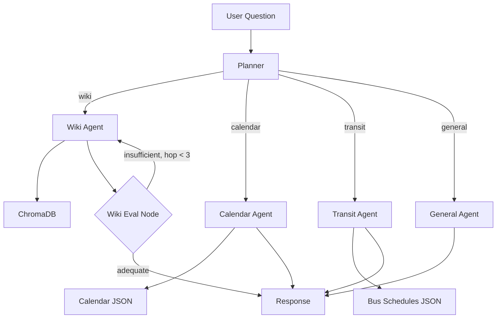

# University Agentic RAG Chat

One-stop chat interface for university questions using Agentic RAG: a **Planner** agent routes to specialized agents; the **Wiki agent** uses the Syracuse Answers (Confluence) wiki via an MCP server.

## Architecture



- **Planner** — Classifies the question (gpt-4o-mini with structured output) and routes to `wiki`, `calendar`, `transit`, or `general`.
- **Wiki agent** — ReAct agent with the `answers_retrieve` MCP tool plus an evaluation loop (up to 3 hops). Uses pre-indexed semantic search (ChromaDB) for fast retrieval, with CQL fallback.
- **Calendar node** — Loads all scraped academic calendar data (~300 entries) as LLM context and answers date/deadline questions.
- **Transit node** — Loads scraped bus/shuttle schedule data (15 routes) as LLM context and answers route/time questions.
- **General node** — Direct LLM call for greetings, general knowledge, and off-topic questions.
- **Frontend** — Next.js app with SSE streaming, thinking steps display, and markdown rendering.

All configuration (API keys, Confluence URL, limits, embedding model, vector store path) is loaded from `.env`; see `.env.example`.

## Tests and CI

- **Local:** With the venv activated, from the project root: `pytest tests/ -q`
- **CI:** [GitHub Actions](.github/workflows/tests.yml) runs the same suite on push and pull requests to `main` or `master` (Python 3.11 and 3.12). No API secrets are required for the current tests.

## Setup

1. **Create and use a separate virtual environment**

   From the project root (`Agentic_AI_Project`):

   **Windows (PowerShell):**
   ```powershell
   python -m venv .venv
   .\.venv\Scripts\Activate.ps1
   pip install -r requirements.txt
   ```

   **Windows (cmd):**
   ```cmd
   python -m venv .venv
   .venv\Scripts\activate.bat
   pip install -r requirements.txt
   ```

   **macOS / Linux:**
   ```bash
   python -m venv .venv
   source .venv/bin/activate
   pip install -r requirements.txt
   ```

   The `.venv` folder is already in `.gitignore`, so the env stays local and is not committed. For the steps below, keep the venv activated (you should see `(.venv)` in your prompt).

2. **Config**

   Copy `.env.example` to `.env` and set at least:

   - `OPENAI_API_KEY` — for Planner and Wiki agent LLM calls.

   Optional: override `CONFLUENCE_BASE_URL`, `DEFAULT_SEARCH_LIMIT`, `DEFAULT_TOP_K` if needed.

   **Wiki RAG (pre-indexed retrieval):** For fast semantic search, set `VECTOR_STORE_PATH` (e.g. `./data/wiki_chroma`) and run the indexer once (or on a schedule). See **Wiki indexer** below.

   **LangSmith (optional):** To trace Planner and Wiki agent runs in [LangSmith](https://smith.langchain.com), set in `.env`:
   - `LANGCHAIN_TRACING_V2=true` (must be lowercase `true`)
   - `LANGCHAIN_API_KEY=<your key from smith.langchain.com>`
   - `LANGCHAIN_PROJECT=university-chat` (or any project name). Restart the API after changing these; traces appear in the LangSmith dashboard.

3. **Run the Wiki MCP server** (for local testing with MCP Inspector)

   With the venv activated:
   ```bash
   python -m mcp_servers.wiki.server
   ```

4. **Wiki indexer (for pre-indexed RAG)**

   To build the vector index so `answers_retrieve` uses fast semantic search instead of live CQL + fetch:

   - Set `VECTOR_STORE_PATH` in `.env` (e.g. `VECTOR_STORE_PATH=./data/wiki_chroma`).
   - Run the indexer (requires `OPENAI_API_KEY`):
     ```bash
     python -m mcp_servers.wiki.indexer
     ```
   - Run the indexer periodically (e.g. cron) to refresh the index. Use `--incremental` to append without clearing (optional).

5. **Run the Chat API**

   With the venv activated, from the project root:
   ```bash
   python -m api.main
   # or: uvicorn api.main:app --reload --port 8000
   ```

   Then `POST /chat` with `{"message": "How do I drop a course?"}`.

## Refreshing data

Both data sources can be refreshed independently. Run these from the project root with the venv activated, then restart the API server to pick up the new data.

| Data source | Command | Output |
|---|---|---|
| Wiki (Answers) | `python -m mcp_servers.wiki.indexer` | `Data/wiki_chroma/` |
| Academic calendar | `python -m scripts.scrape_calendar` | `Data/calendar.json` |
| Bus schedules | `python -m scripts.scrape_bus_schedules` | `Data/bus_schedules.json` |

- **Wiki indexer** — Re-fetches all Confluence pages, chunks them, generates embeddings, and rebuilds the ChromaDB vector store. Add `--incremental` to append without clearing the existing collection.
- **Calendar scraper** — Re-fetches the Syracuse academic calendar pages, parses HTML tables, and writes structured JSON with ~300 date entries.
- **Bus schedule scraper** — Downloads shuttle and Centro bus PDFs, extracts timetable text via pdfplumber, and writes structured JSON with 15 route schedules.

All three are safe to re-run at any time (e.g. via cron job) to keep data current.

## Project layout

- `config/` — Central config (`.env` + `config/settings.py`).
- `agent/` — LangGraph: `planner.py` (Planner), `wiki_agent.py` (Wiki sub-graph with MCP tools), `state.py`.
- `mcp_servers/wiki/` — Confluence client, chunker, vector store (Chroma), indexer, FastMCP server with the `answers_retrieve` tool.
- `api/` — FastAPI chat endpoint.

## Implementation order (from plan)

1. Central config (`.env`, `.env.example`, `config/settings.py`)
2. Planner agent (route → wiki | calendar | general)
3. Wiki MCP (`answers_retrieve` semantic retrieve)
4. Wiki agent (ReAct + wiki MCP tool, cited answers)
5. Chat API (Planner + Wiki wired, POST /chat)
