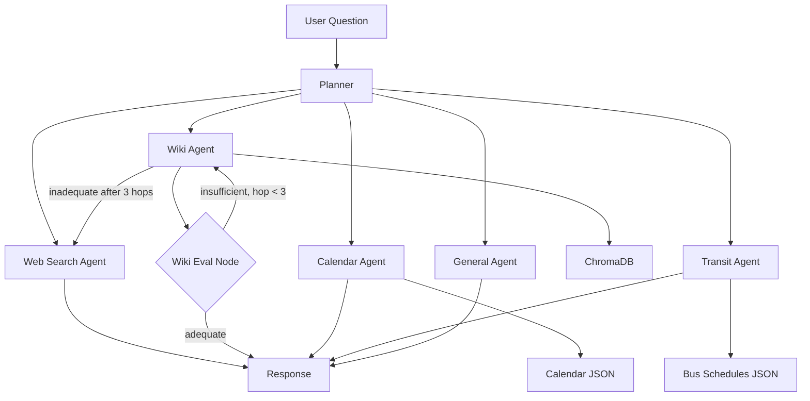

# University Agentic RAG Chat

One-stop chat interface for university questions using Agentic RAG: a **Planner** agent routes to specialized agents; the **Wiki agent** uses the Syracuse Answers (Confluence) wiki via an MCP server.

## Architecture



- **Planner** — Classifies the question (gpt-4o-mini with structured output) and routes to exactly one of `wiki`, `calendar`, `transit`, `general`, or `web`.
- **Web agent** — When the planner chooses `web`, first applies a lightweight LLM query-enhancement step (keeps intent, expands vague queries with relevant Syracuse context), then runs Tavily **search** (up to 5 results) and **extract** on those URLs. Requires `TAVILY_API_KEY`; without it, the model is told no excerpts were returned.
- **Wiki agent** — ReAct agent with the `answers_retrieve` MCP tool plus an evaluation loop (up to 3 hops). Each hop is judged for whether the answer **clearly** satisfies the question; if not, the query is retried. After the third hop, if the answer is still inadequate, the graph **escalates to the same web agent** used for the `web` route (streaming shows a thinking step; stored `route` remains `wiki`). Uses pre-indexed semantic search (ChromaDB) for fast retrieval, with CQL fallback.
- **Calendar node** — Loads all scraped academic calendar data (~300 entries) as LLM context and answers date/deadline questions.
- **Transit node** — Loads scraped bus/shuttle schedule data (15 routes) as LLM context and answers route/time questions.
- **General node** — Short replies for greetings, thanks, and “what can you do?” only; substantive or open-web questions should route to `web` (or wiki/calendar/transit when applicable).
- **Frontend** — Next.js app with SSE streaming, thinking steps display, and markdown rendering. When the route is `web`, `/chat/stream` shows a **thinking** status for the Tavily step before tokens stream. Wiki escalation to web clears streamed wiki tokens so the web answer does not append to partial wiki text.

All configuration (API keys, Confluence URL, limits, embedding model, vector store path, Tavily) is loaded from `.env`; see `.env.example`.

## Tests and CI

- **Local:** With the venv activated, from the project root: `pytest tests/ -q`
- **CI:** [GitHub Actions](.github/workflows/tests.yml) runs the same suite on push and pull requests to `main` or `master` (Python 3.11 and 3.12). No API secrets are required for the current tests.

## Local persistence (auth and chat history)

The chat API uses a gitignored **`data/`** directory at the project root (override with env **`DATA_DIR`**) for:

- **`users.json`** — accounts (email/password for local dev; see `api/auth_store.py`)
- **`chats.db`** — SQLite DB for per-user thread list and message transcripts for the UI
- **`checkpoints.db`** — LangGraph `AsyncSqliteSaver` state keyed by `thread_id` (short-term agent memory)

Set **`JWT_SECRET`** in `.env` for production; the default is only for development. The Next.js app shows a login/signup modal first, then loads threads via `GET /chats` and sends `thread_id` with `POST /chat/stream`. Transcript writes run in FastAPI **background tasks** after streaming completes so they do not block the SSE response.

**Multi-turn context:** For a given `thread_id`, LangGraph merges each user message into checkpointed `messages`, and each assistant reply is stored as an `AIMessage` so the next turn sees prior user/assistant exchanges. Leaf nodes (`general`, `calendar`, `transit`, `web`) receive a trimmed window of recent messages (see `agent/conversation.py`); the wiki path injects prior turns as a short text prefix around the current question. **Routing** still uses only the **latest user message** for classification (low latency); if follow-ups often mis-route, you can extend `_route_node` to pass the last few messages.

## Setup

1. **Create and use a separate virtual environment**

   From the project root (`Agentic_AI_Project`):

   **Windows (PowerShell):**
   ```powershell
   python -m venv .venv
   .\.venv\Scripts\Activate.ps1
   pip install -r requirements.txt
   ```

   **Windows (cmd):**
   ```cmd
   python -m venv .venv
   .venv\Scripts\activate.bat
   pip install -r requirements.txt
   ```

   **macOS / Linux:**
   ```bash
   python -m venv .venv
   source .venv/bin/activate
   pip install -r requirements.txt
   ```

   The `.venv` folder is already in `.gitignore`, so the env stays local and is not committed. For the steps below, keep the venv activated (you should see `(.venv)` in your prompt).

2. **Config**

   Copy `.env.example` to `.env` and set at least:

   - `OPENAI_API_KEY` — for Planner and Wiki agent LLM calls.

   Optional: **`TAVILY_API_KEY`** — required for useful answers on the **`web`** route (Tavily search + extract). Without it, the web agent still runs but sees no excerpts. The **`tavily-python`** package must be installed in the same environment as the API (`pip install -r requirements.txt`); if it is missing, web search will not run. Optional tuning: `TAVILY_MAX_RESULTS` (default 5), `TAVILY_CONTEXT_MAX_CHARS`.

   Optional: override `CONFLUENCE_BASE_URL`, `DEFAULT_SEARCH_LIMIT`, `DEFAULT_TOP_K` if needed.

   **Wiki RAG (pre-indexed retrieval):** For fast semantic search, set `VECTOR_STORE_PATH` (e.g. `./data/wiki_chroma`) and run the indexer once (or on a schedule). See **Scripts**.

   **LangSmith (optional):** To trace Planner and Wiki agent runs in [LangSmith](https://smith.langchain.com), set in `.env`:
   - `LANGCHAIN_TRACING_V2=true` (must be lowercase `true`)
   - `LANGCHAIN_API_KEY=<your key from smith.langchain.com>`
   - `LANGCHAIN_PROJECT=university-chat` (or any project name). Restart the API after changing these; traces appear in the LangSmith dashboard.

3. **Run the Wiki MCP server** (for local testing with MCP Inspector)

   With the venv activated:
   ```bash
   python -m mcp_servers.wiki.server
   ```

4. **Wiki indexer (for pre-indexed RAG)**

   To build the vector index so `answers_retrieve` uses fast semantic search instead of live CQL + fetch:

   - Set `VECTOR_STORE_PATH` in `.env` (e.g. `VECTOR_STORE_PATH=./data/wiki_chroma`).
   - Run the indexer (requires `OPENAI_API_KEY`):
     ```bash
     python -m mcp_servers.wiki.indexer
     ```
   - Run the indexer periodically (e.g. cron) to refresh the index. Use `--incremental` to append without clearing (optional). Full command and details are in **Scripts**.

5. **Run the Chat API**

   With the venv activated, from the project root:
   ```bash
   python -m api.main
   # or: uvicorn api.main:app --reload --port 8000
   ```

   Chat endpoints require a JWT: `POST /auth/signup` or `/auth/login`, then `POST /chats` to create a thread, then `POST /chat` or `/chat/stream` with `Authorization: Bearer <token>` and body including `thread_id` and `message`. The Next.js frontend handles this flow.

## Scripts

Run these from the project root with the venv activated unless noted. For scrapers and the wiki indexer, restart the API afterward so it picks up new files or the vector store.

| Script | Command | Output / effect |
|---|---|---|
| Wiki (Answers) indexer | `python -m mcp_servers.wiki.indexer` | `Data/wiki_chroma/` (or `VECTOR_STORE_PATH`) |
| Academic calendar | `python -m scripts.scrape_calendar` | `Data/calendar.json` |
| Bus schedules | `python -m scripts.scrape_bus_schedules` | `Data/bus_schedules.json` |
| Clear UI chats | `python -m scripts.clear_chats` | Deletes all threads and messages in `chats.db` (honours **`DATA_DIR`**); does not modify `checkpoints.db` |

- **Wiki indexer** — Re-fetches Confluence pages, chunks them, generates embeddings, and rebuilds the ChromaDB collection. Add `--incremental` to append without clearing the existing collection.
- **Calendar scraper** — Re-fetches Syracuse academic calendar pages, parses HTML tables, and writes structured JSON with ~300 date entries.
- **Bus schedule scraper** — Downloads shuttle and Centro bus PDFs, extracts timetable text via pdfplumber, and writes structured JSON with 15 route schedules.
- **Clear UI chats** — Wipes stored chat transcripts for the UI only. LangGraph checkpoint state for `thread_id` is unchanged; use only when you want an empty thread list without deleting accounts (`users.json`).

The indexer and scrapers are safe to re-run on a schedule (e.g. cron) to keep data current.

## Project layout

- `config/` — Central config (`.env` + `config/settings.py`).
- `agent/` — LangGraph: `planner.py` (Planner), `wiki_agent.py` (Wiki sub-graph with MCP tools), `state.py`, `conversation.py` (trimmed chat history for multi-turn prompts).
- `mcp_servers/wiki/` — Confluence client, chunker, vector store (Chroma), indexer, FastMCP server with the `answers_retrieve` tool.
- `api/` — FastAPI: JWT auth (`/auth/*`), chat CRUD (`/chats`), streaming `/chat/stream` with checkpointed threads; local JSON + SQLite under `data/`.

## Implementation order (from plan)

1. Central config (`.env`, `.env.example`, `config/settings.py`)
2. Planner agent (route → wiki | calendar | transit | general | web)
3. Wiki MCP (`answers_retrieve` semantic retrieve)
4. Wiki agent (ReAct + wiki MCP tool, cited answers)
5. Chat API (Planner + Wiki wired, POST /chat)
